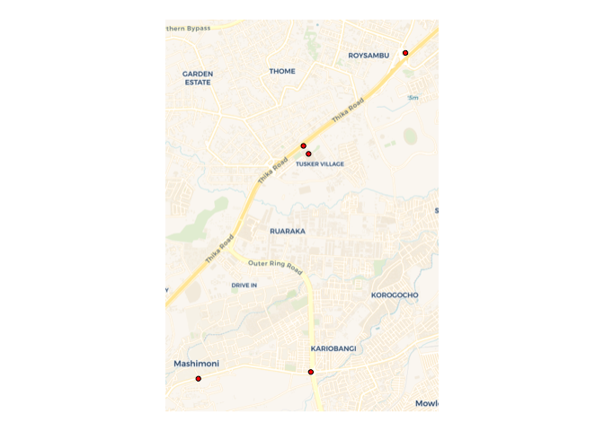

<!-- README.md is generated from README.Rmd. Please edit that file -->

# Unique Location Extractor (ULEx) 

<!-- badges: start -->

[](https://cran.r-project.org/package=ulex)
[](https://github.com/dime-worldbank/ulex/graphs/commit-activity)
[](https://opensource.org/license/mit)
[](https://github.com/dime-worldbank/ulex/actions/workflows/R-CMD-check.yaml)
<!-- badges: end -->

- [Overview](#overview)
- [Installation](#installation)
- [Main functions](#main-functions)
- [Quick start](#quick-start)
- [Additional information on main functions](#addn-info)

## Overview <a name="overview"></a>

Text often contains references to the locations of events where we want
to extract the location of the event. For example, consider this example
tweet that reports a road traffic crash in Nairobi, Kenya, where we are
interested in determining the location of the crash:

> crash occurred near garden city on thika road on your way towards
> roysambu.

The tweet contains three location references: (1) garden city, (2) thika
road and (3) roysambu, where ‘garden city’ is the name of multiple
locations. Here, we are interested in extracting the location of the
garden city location on Thika road that represents the crash site.

**The Unique Location Extractor (ULEx) geoparses text to extract the
unique location of events.** The algorithm takes advantage of contextual
information contained within text (references to roads or administrate
areas, such as neighborhoods) and determines which location references
do not reference the event of interest and should be ignored.

This package was originally developed to extract locations of road
traffic crashes from reports of crashes via Twitter, specifically in the
context of Nairobi, Kenya using the Twitter feed
[@Ma3Route](https://twitter.com/Ma3Route?ref_src=twsrc%5Egoogle%7Ctwcamp%5Eserp%7Ctwgr%5Eauthor).
For more information, see our article here:

> [Milusheva S, Marty R, Bedoya G, Williams S, Resor E, Legovini A
> (2021) Applying machine learning and geolocation techniques to social
> media data (Twitter) to develop a resource for urban planning. PLoS
> ONE 16(2): e0244317.
> https://doi.org/10.1371/journal.pone.0244317](https://journals.plos.org/plosone/article?id=10.1371/journal.pone.0244317)

## Installation <a name="installation"></a>

You can install the development version of `ulex` from GitHub with:

``` r
# install.packages("devtools")
devtools::install_github("dime-worldbank/ulex")
```

## Main functions <a name="main-functions"></a>

The package contains two main functions:

- **augment_gazetteer:** The backbone of locating events is looking up
  location references in a gazetteer, or geographic dictionary. The
  `augment_gazetteer` facilitates cleaning a gazetteer that may have
  been constructed from sources such as
  [OpenStreetMaps](https://cran.r-project.org/web/packages/osmdata/vignettes/osmdata.html),
  [Geonames](https://github.com/ropensci/geonames) or [Google
  Maps](https://www.rdocumentation.org/packages/googleway/versions/2.7.1/topics/google_places).
  For more information on the function, see [here](#addn-aug).

- **locate_event:** Takes text as input and returns the location of the
  relevant event. Key inputs include the text to geoparse, a gazetteer
  of landmarks, spatial files of roads and areas (e.g., neighborhoods)
  and a list of event words. For more information on the function, see
  [here](#addn-loc).

## Quick Start <a name="quick-start"></a>

- [Setup](#setup)
- [Create location datasets](#create-loc-data)
  - [Dataset of Wards](#create-areas)
  - [Dataset of roads](#create-roads)
  - [Dataset of landmarks (landmark gazetteer)](#create-landmarks)
- [Augment gazetteer](#aug-gazettee)
- [Location events](#loc-events)

### Setup <a name="setup"></a>

``` r
#### Install package
## Install/Load Package Dependencies
if (!require("pacman")) install.packages("pacman")
pacman::p_load(magrittr, lubridate, dplyr, tidyr, readr, purrr, tidytext,
               stringr, stringi, ngram, hunspell, stringdist, tm, raster,
               parallel, jsonlite, sf, quanteda, geodist)

library(spacyr)

## Load ULEx Functions
source("~/Documents/Github/ulex/R/helper_functions.R")
source("~/Documents/Github/ulex/R/augment_gazetteer.R")
source("~/Documents/Github/ulex/R/locate_event.R")

library(geodata)
library(osmdata)
library(ggplot2)
library(stringr)
```

### Create location datasets <a name="create-loc-data"></a>

#### Dataset of Wards <a name="create-areas"></a>

We create a dataset of Wards in Nairobi from
[GADM](https://gadm.org/data.html).

``` r
ken_sf <- gadm(country = "KEN", level = 3, path = tempdir()) %>% st_as_sf()
nbo_sf <- ken_sf %>%
  filter(NAME_1 %in% "Nairobi") %>%
  rename(name = NAME_3) %>%
  dplyr::select(name)

head(nbo_sf)
#> Simple feature collection with 6 features and 1 field
#> Geometry type: POLYGON
#> Dimension:     XY
#> Bounding box:  xmin: 36.67803 ymin: -1.302667 xmax: 36.81967 ymax: -1.256238
#> Geodetic CRS:  WGS 84
#>         name                       geometry
#> 1     Gatina POLYGON ((36.7601 -1.268443...
#> 2 Kileleshwa POLYGON ((36.81139 -1.27213...
#> 3   Kilimani POLYGON ((36.75393 -1.28606...
#> 4     Kabiro POLYGON ((36.7373 -1.275437...
#> 5 Kawangware POLYGON ((36.74915 -1.27165...
#> 6   Mutu-Ini POLYGON ((36.67803 -1.29837...
```

#### Dataset of roads <a name="create-roads"></a>

We create a dataset of roads from
[OpenStreetMaps](https://www.openstreetmap.org/).

``` r
roads_sf <- opq(st_bbox(nbo_sf), timeout = 999) %>%
  add_osm_feature(key = "highway", value = c("motorway",
                                             "trunk",
                                             "primary",
                                             "secondary",
                                             "tertiary",
                                             "unclassified")) %>%
  osmdata_sf()
roads_sf <- roads_sf$osm_lines

roads_sf <- roads_sf %>%
  filter(!is.na(name)) %>%
  dplyr::select(name) %>%
  mutate(name = name %>% tolower())

head(roads_sf)
#> Simple feature collection with 6 features and 1 field
#> Geometry type: LINESTRING
#> Dimension:     XY
#> Bounding box:  xmin: 36.80283 ymin: -1.348233 xmax: 36.91442 ymax: -1.286476
#> Geodetic CRS:  WGS 84
#>                              name                       geometry
#> 4685092        airport south road LINESTRING (36.91442 -1.344...
#> 4716860        state house avenue LINESTRING (36.80434 -1.286...
#> 4716861          processional way LINESTRING (36.81367 -1.287...
#> 4716862           kenyatta avenue LINESTRING (36.81026 -1.289...
#> 4716887           kenyatta avenue LINESTRING (36.81188 -1.289...
#> 4723375 city mortuary round about LINESTRING (36.80306 -1.298...
```

#### Dataset of landmarks (landmark gazetteer) <a name="create-landmarks"></a>

We create a gazetteer of landmarks from
[OpenStreetMaps](https://www.openstreetmap.org/). From OpenStreetMaps,
we use all amenities and bus stops.

``` r
# Amenities --------------------------------------------------------------------
amenities_sf <- opq(st_bbox(nbo_sf), timeout = 999) %>%
  add_osm_feature(key = "amenity") %>%
  osmdata_sf()

amenities_pnt_sf <- amenities_sf$osm_points
amenities_ply_sf <- amenities_sf$osm_polygons %>%
  st_centroid()

amenities_sf <- bind_rows(amenities_pnt_sf,
                          amenities_ply_sf) %>%
  dplyr::mutate(type = amenity)

# Bus Stops --------------------------------------------------------------------
busstops_sf <- opq(st_bbox(nbo_sf), timeout = 999) %>%
  add_osm_feature(key = "highway",
                  value = "bus_stop") %>%
  osmdata_sf()

busstops_sf <- busstops_sf$osm_points

busstops_sf <- busstops_sf %>%
  mutate(type = "bus_stop")

# Append -----------------------------------------------------------------------
landmarks_sf <- bind_rows(amenities_sf,
                          busstops_sf) %>%
  filter(!is.na(name)) %>%
  dplyr::select(name, type) %>%
  mutate(name = name %>% tolower())

head(landmarks_sf)
#> Simple feature collection with 6 features and 2 fields
#> Geometry type: POINT
#> Dimension:     XY
#> Bounding box:  xmin: 36.70606 ymin: -1.325597 xmax: 36.80624 ymax: -1.292358
#> Geodetic CRS:  WGS 84
#>                                        name             type
#> 30031187 regina caeli karen catholic church place_of_worship
#> 30088423                        china plate       restaurant
#> 30088443                              rubis             fuel
#> 30088444                      shell kabuagi             fuel
#> 30088453               karen police station           police
#> 30092033                              total             fuel
#>                            geometry
#> 30031187  POINT (36.7107 -1.325597)
#> 30088423 POINT (36.80624 -1.292358)
#> 30088443 POINT (36.71747 -1.317521)
#> 30088444 POINT (36.71842 -1.316594)
#> 30088453 POINT (36.70606 -1.321773)
#> 30092033 POINT (36.78867 -1.299975)
```

#### Map landmark, road, and area dictionaries

The below map shows the locations in the landmark, roads, and area
dictionaries.

``` r
ggplot() +
  geom_sf(data = roads_sf,
          aes(color = "Roads"),
          linewidth = 0.6) +
  geom_sf(data = landmarks_sf,
          aes(color = "Landmarks"),
          size = 0.1,
          alpha = 0.5) +
  geom_sf(data = nbo_sf,
          fill = "gray",
          aes(color = "Wards"),
          linewidth = 0.5,
          alpha = 0.2) +
  labs(color = NULL,
       title = "Landmarks, Roads, and Wards") +
  scale_color_manual(values = c("blue", "chartreuse3", "black")) +
  theme_void() +
  theme(plot.title = element_text(face = "bold"))
```


### Augment Gazetteer <a name="aug-gazetteer"></a>

Here, we augment the landmark gazetteer—which increases the number of
entries from about 11,000 to 50,000.

``` r
landmarks_aug_sf <- augment_gazetteer(landmarks_sf)

print(nrow(landmarks_sf))
#> [1] 11165
print(nrow(landmarks_aug_sf))
#> [1] 49992

head(landmarks_aug_sf)
#> Simple feature collection with 6 features and 3 fields
#> Geometry type: POINT
#> Dimension:     XY
#> Bounding box:  xmin: 36.70606 ymin: -1.325597 xmax: 36.80624 ymax: -1.292358
#> Geodetic CRS:  WGS 84
#>                                        name              type
#> 30031187 regina caeli karen catholic church  place_of_worship
#> 30088423                        china plate        restaurant
#> 30088443                              rubis              fuel
#> 30088444                      shell kabuagi              fuel
#> 30088453               karen police station            police
#> 30092079   nairobi international trade fair exhibition_centre
#>                               name_original                   geometry
#> 30031187 regina caeli karen catholic church  POINT (36.7107 -1.325597)
#> 30088423                        china plate POINT (36.80624 -1.292358)
#> 30088443                              rubis POINT (36.71747 -1.317521)
#> 30088444                      shell kabuagi POINT (36.71842 -1.316594)
#> 30088453               karen police station POINT (36.70606 -1.321773)
#> 30092079   nairobi international trade fair POINT (36.76114 -1.307832)
```

### Locate Events <a name="loc-events"></a>

We geolocate the location of crashes contained in five texts.

``` r
texts <- c("crash at garden city",
            "crash occurred near garden city on thika road on your way towards 
            roysambu",
            "crash at intersection of juja road and outer ring rd",
            "crash occured near roysambu on thika rd",
            "crash near mathare centre along juja road")

crashes_sf <- locate_event(text = texts,
                           landmark_gazetteer = landmarks_aug_sf,
                           areas = nbo_sf,
                           roads = roads_sf,
                           event_words = c("accident", "crash", "collision", 
                                           "wreck", "overturn"))
```

``` r
ggplot() +
  geom_sf() +
  geom_sf(data = nbo_sf,
          fill = "gray",
          color ="gray") +
  geom_sf(data = crashes_sf,
          pch = 21,
          color = "black",
          fill = "red") +
  theme_void()
```



The output of `locate_event()` has the following variables:

- **text:** Original text to geocode.
- **matched_words_correct_spelling:** Names of locations used to geocode
  event, as names appear in landmark, roads, and area datasets.  
- **matched_words_text_spelling:** Names of locations used to geocode
  event, as name appears in text.  
- **dist_closest_event_word:** Distance of landmark to event word (ie,
  number of words between event word and location word).  
- **type:** Type of location (e.g., landmark, intersection).  
- **how_determined_location:** Information on how location was
  determined.  
- **dist_mentioned_road_m:** Distance (meters) of event location to
  mentioned road.  
- **lon_all:** All landmark locations found in text (longitude).  
- **lat_all:** All landmark locations found in text (latitude).  
- **landmarks_all_text_spelling:** Names of all landmarks found, as name
  appears in text.  
- **landmarks_all_correct_spelling:** Names of all landmarks found, as
  name appears in landmark gazetteer.  
- **landmarks_all_location:** Names of landmarks and locations
  (name,latitude,longitude).  
- **roads_all_text_spelling:** Names of roads in text, as name appears
  in text.  
- **roads_all_correct_spelling:** Name of roads in text, as name appears
  in road dataset.  
- **intersection_all_text_spelling:** Name of intersection (e.g., pairs
  of roads that make intersection), as name appears in text.  
- **intersection_all_correct_spelling:** Name of intersection (e.g.,
  pairs of roads that make intersection), as name appears road dataset.
- **intersection_all_location:** Name and locations of intersections
  (name,latitude,longitude).  
- **geometry:** Geometry of event location.

``` r
head(crashes_sf)
#> Simple feature collection with 5 features and 17 fields
#> Geometry type: POINT
#> Dimension:     XY
#> Bounding box:  xmin: 36.86339 ymin: -1.263214 xmax: 36.89176 ymax: -1.218554
#> Geodetic CRS:  WGS 84
#>                                                                         text
#> 1                                                       crash at garden city
#> 2 crash occurred near garden city on thika road on your way towards roysambu
#> 3                       crash at intersection of juja road and outer ring rd
#> 4                                    crash occured near roysambu on thika rd
#> 5                                  crash near mathare centre along juja road
#>   matched_words_correct_spelling matched_words_text_spelling
#> 1                    garden city                 garden city
#> 2                    garden city                 garden city
#> 3        juja road,outer ring rd     juja road,outer ring rd
#> 4                       roysambu                    roysambu
#> 5                 mathare centre              mathare centre
#>   dist_closest_event_word         type
#> 1                       2     landmark
#> 2                       3     landmark
#> 3                    <NA> intersection
#> 4                       3     landmark
#> 5                       2     landmark
#>                                                                                             how_determined_location
#> 1                                                        crashword_tier_crashword_prepos_tier_1preposition_landmark
#> 2 crashword_tier_crashword_other_prepos_tier_2preposition_landmark;restrict_landmarks_close_to_road;snapped_to_road
#> 3                                                                                                 intersection_word
#> 4                                                  crashword_tier_crashword_other_prepos_tier_2preposition_landmark
#> 5       crashword_tier_crashword_prepos_tier_2preposition_landmark;restrict_landmarks_close_to_road;snapped_to_road
#>   dist_mentioned_road_m
#> 1                    NA
#> 2             0.1138995
#> 3             9.3633326
#> 4                    NA
#> 5             5.1565383
#>                                                                                                             lon_all
#> 1 36.8779701;36.8780867;36.8788693;36.8787449;36.8784728;36.8783717;36.8783882;36.877926;36.878982133789;36.8790582
#> 2                                                            36.8774006;36.8776376;36.8780562;36.8773468;36.8784865
#> 3                                                                                                  36.8787944172118
#> 4                                                             36.892742;36.8910567;36.8914926;36.8925596;36.8909309
#> 5                                                            36.8657684;36.8637369;36.8643478;36.8631133;36.8599741
#>                                                                                                    lat_all
#> 1 -1.2323486;-1.2320662;-1.2329316;-1.232074;-1.2332295;-1.2325403;-1.2330105;-1.23139664524347;-1.2322988
#> 2                                                       -1.231608;-1.2314164;-1.231087;-1.23165;-1.2307509
#> 3                                                                                        -1.26230037028693
#> 4                                                   -1.2185699;-1.2204266;-1.2175606;-1.2182267;-1.2179853
#> 5                                                    -1.2625076;-1.2630666;-1.262893;-1.2632442;-1.2643594
#>   landmarks_all_text_spelling landmarks_all_correct_spelling
#> 1                 garden city                    garden city
#> 2        garden city;roysambu           garden city;roysambu
#> 3                        <NA>                           <NA>
#> 4                    roysambu                       roysambu
#> 5              mathare centre                 mathare centre
#>                                                                                                                                                                                                                                                                                                                                                                                                                                                                                                                        landmarks_all_location
#> 1                                                                                                                                                                                garden city,-1.2330105,36.8783882;garden city,-1.2323486,36.8779701;garden city,-1.232074,36.877926;garden city,-1.2322988,36.8790582;garden city,-1.2320662,36.8780867;garden city,-1.232074,36.8787449;garden city,-1.2329316,36.8788693;garden city,-1.2332295,36.8784728;garden city,-1.23139664524347,36.878982133789;garden city,-1.2325403,36.8783717
#> 2                      roysambu,-1.2182267,36.8925596;roysambu,-1.2185699,36.892742;roysambu,-1.2179853,36.8909309;roysambu,-1.2204266,36.8910567;garden city,-1.2330105,36.8783882;roysambu,-1.2175606,36.8914926;garden city,-1.2323486,36.8779701;garden city,-1.232074,36.877926;garden city,-1.2322988,36.8790582;garden city,-1.2320662,36.8780867;garden city,-1.232074,36.8787449;garden city,-1.2329316,36.8788693;garden city,-1.2332295,36.8784728;garden city,-1.23139664524347,36.878982133789;garden city,-1.2325403,36.8783717
#> 3                                                                                                                                                                                                                                                                                                                                                                                                                                                                                                                                        <NA>
#> 4                                                                                                                                                                                                                                                                                                                                                                                   roysambu,-1.2182267,36.8925596;roysambu,-1.2185699,36.892742;roysambu,-1.2179853,36.8909309;roysambu,-1.2204266,36.8910567;roysambu,-1.2175606,36.8914926
#> 5 mathare centre,-1.2611937,36.8653216;mathare centre,-1.2617117,36.8577317;mathare centre,-1.2638293,36.845051;mathare centre,-1.2611119,36.8638678;mathare centre,-1.2618483,36.8656506;mathare centre,-1.26414643275423,36.8546990206489;mathare centre,-1.2614051,36.862644;mathare centre,-1.262266,36.8501481;mathare centre,-1.2624083,36.8501916;mathare centre,-1.249874,36.876873;mathare centre,-1.2617267,36.86359;mathare centre,-1.2615767,36.8638023;mathare centre,-1.2639967,36.8450983;mathare centre,-1.2617323,36.8634252
#>   roads_all_text_spelling roads_all_correct_spelling
#> 1                    <NA>                       <NA>
#> 2              thika road                 thika road
#> 3 juja road;outer ring rd    juja road;outer ring rd
#> 4                    <NA>                       <NA>
#> 5               juja road                  juja road
#>   intersection_all_text_spelling intersection_all_correct_spelling
#> 1                           <NA>                              <NA>
#> 2                           <NA>                              <NA>
#> 3        juja road,outer ring rd           juja road,outer ring rd
#> 4                           <NA>                              <NA>
#> 5                           <NA>                              <NA>
#>                                    intersection_all_location
#> 1                                                       <NA>
#> 2                                                       <NA>
#> 3 juja road,outer ring rd,-1.26230037028693,36.8787944172118
#> 4                                                       <NA>
#> 5                                                       <NA>
#>                     geometry
#> 1 POINT (36.87849 -1.232397)
#> 2 POINT (36.87779 -1.231302)
#> 3   POINT (36.87879 -1.2623)
#> 4 POINT (36.89176 -1.218554)
#> 5 POINT (36.86339 -1.263214)
```

## Additional information on main functions <a name="addn-info"></a>

### `augment_gazetteer()` <a name="addn-aug"></a>

The `augment_gazetteer` function adds additional landmarks to account
for different ways of saying the same landmark name. For example, raw
gazetteers may contain long, formal names, where shorter versions of the
name are more often used. In addition, the function facilitates removing
landmarks names that are spurious or may confuse the algorithm; these
include landmark names that are common words that may be used in
different contexts, or frequent and generic landmarks such as `hotel`.
Key components of the function include:

1.  Adding additional landmarks based off of n-grams and skip-grams of
    landmark names. For example, from the original landmark
    `garden city mall`, the following landmarks will be added:
    `garden city`, `city mall`, and `garden mall`.
2.  Adding landmarks according to a set of rules: for example, if a
    landmark starts or ends with a certain word, an alternative version
    of the landmark is added that removes that word. Here, words along
    categories of landmarks are removed, where a user may not reference
    the category; for example, a user will more likely say `McDonalds`
    than `McDonalds restaurant.`
3.  Removes landmarks that refer to large geographic areas (e.g.,
    roads). Roads and areas are dealt with separately; this function
    focuses on cleaning a gazetteer of specific points/landmarks.

**Pages S4 to S6 in the supplementary information file
[here](https://journals.plos.org/plosone/article?id=10.1371/journal.pone.0244317#sec005)
provides further details on the augment gazetteer algorithm**

### `locate_event()` <a name="addn-loc"></a>

The `locate_event` function extracts landmarks from text and determines
the unique location of events from the text. The algorithm works in two
steps: (1) finding locations in text and (2) determining a unique
location.

*Finding location references in text*

To extract location references from text, the function implements the
following steps to extract location references from text.

1.  Determines whether any text matches names in the gazetteer. Both
    exact and ‘fuzzy’ matches (allowing a certain Levenstein distance)
    are used.
2.  Rely on words after prepositions to find locations. The algorithm
    starts with a word after a preposition and extracts all landmarks
    that contain that word. Then, the algorithm takes the next word in
    the text and further subsets the landmarks. This process is repeated
    until adding a word removes all landmarks. If a road or area (eg,
    neighborhood) is found in the previous step, only landmarks near
    that road or neighborhood are considered. Landmarks with the
    shortest number of words are kept (i.e., if this process finds 5
    landmarks with 2 words and 7 landmarks with 3 words, only the 5
    landmarks with 2 words are kept).
3.  If a road or area is mentioned and a landmark is not near that road
    or landmark, longer versions of the landmark that are near the road
    or area are searched for. For example, if a user says
    `crash near garden on thika road`, the algorithm may extract
    multiple landmarks with the name `garden`, none of which are near
    Thika road. It will then search for all landmarks that contain
    `garden` in them (e.g., `garden city mall`) that are near Thika
    road.
4.  If two roads are mentioned, the algorithm extracts the intersection
    of the roads.

*Determine unique location*

After extracting landmarks, the algorithm seeks to identify a single
location using a series of steps. These steps consider a defined list of
event words (eg, for road traffic crashes, these could include ‘crash’,
‘accident’, ‘overturn’, etc), whether the user mentions a junction word
(e.g., ‘junction’ or ‘intersection’) and a list of prepositions. Certain
prepositions are given precedent over others to distinguish between
locations indicating the location of an event versus locations further
away that provide additional context; for example, `at` takes higher
precedence that `towards`. The following main series of steps are used
in the following order:

1.  Locations that follow the pattern \[event word\] \[preposition\]
    \[location\] are extracted.
2.  Locations that follow the pattern \[preposition\] \[location\] are
    extracted. If multiple occurrences, the location near the higher
    order preposition is used. If a tie, the location closest to the
    event word is used.
3.  If a junction word is used, two roads are mentioned, and the two
    roads intersect once, the intersection point is used.
4.  The location closest to the event word within the text is used.
5.  If the location name has multiple locations, we (1) restrict to
    locations near any mentioned road or area, (2) check for a dominant
    cluster of locations and (3) prioritize certain landmark types over
    others (e.g., a user is more likely to reference a large, well known
    location type like a stadium).
6.  If a landmark is not found, but a road or area are found, the road
    or area are returned. If a road and area are mentioned, the
    intersection of the road and area is returned.

**Pages S15 to S19 in the supplementary information file
[here](https://journals.plos.org/plosone/article?id=10.1371/journal.pone.0244317#sec005)
provides further details on the locate event algorithm**
